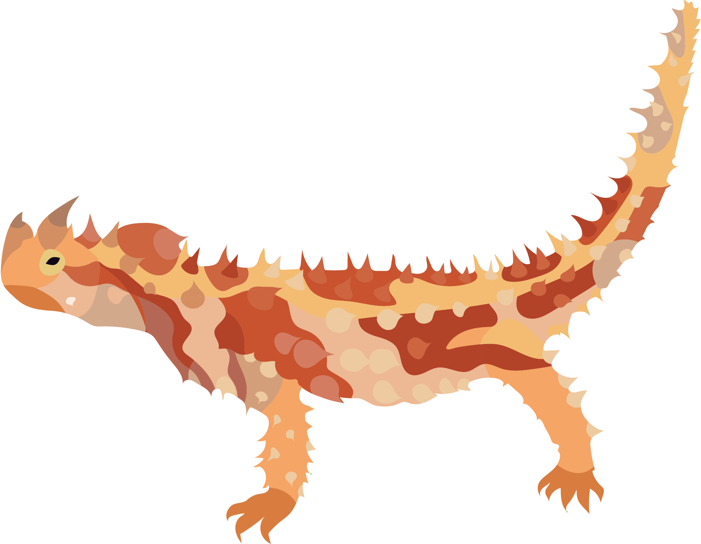

# Amphibolurinae Dragons

Our paper addresses a fundamental question in biology: how do new ecologies and morphologies develop? We have long used the adaptive landscape as a way to identify and cluster species into adaptive zones following the ideas of G.G. Simpson. However, it has remained difficult to explain how new regions of the adaptive landscape become populated. Using a novel high-dimensional morphological dataset paired with genome-scale genetic data we find evidence for the pivotal role generalist species play in connecting disparate adaptive peaks. Our investigation of the lizard body plan suggests that transitions among specialist morphologies (e.g. arboreality, burrowing) are facilitated by generalist ancestors acting as intermediaries. This generalist-to-specialist transition provides a key pathway for explaining how ecological opportunity can result in adaptive radiation.

Included in this repository are the listed directories. Each includes a `README.md` file that explains the files it holds.

---

### [**Alignments**](Alignments/): 
+ alignment files and locus trees

---

### [**Data**](Data/): 
+ morphological data for analysis

---

### [**Figures**](Figures)/: 
+ all visualizations generated for this project

---

### [**Manuscript**](Manuscript/): 
+ manuscript files

---

### [**Presentations**](Presentations/): 
+ conference talks

---

### [**Scripts**](Scripts/): 
+ data processing, analysis, and visualization code

---

### [**Supplement**](Supplement/): 
+ supplementary figures and tables referenced in the manuscript

### [**Trees**](Trees/): 
+ phylogenetic trees 